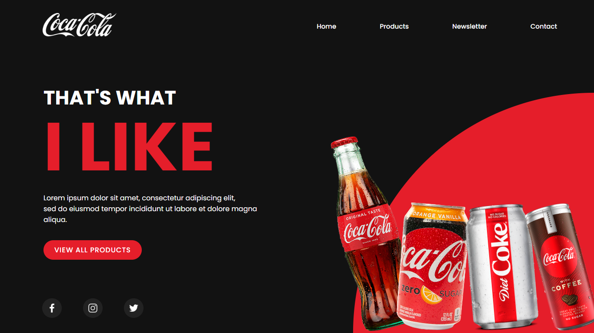

# LandingPage
<h3>EN - Coca-Cola Lading Page with Animations Using Pure CSS;</h3>
<h3>PT - Lading page da coca cola com animações usando CSS puro;</h3>
<h4>Deploy: https://johnandrade65.github.io/Coca-Cola-Landing-Page/</h4>

 
  
  

